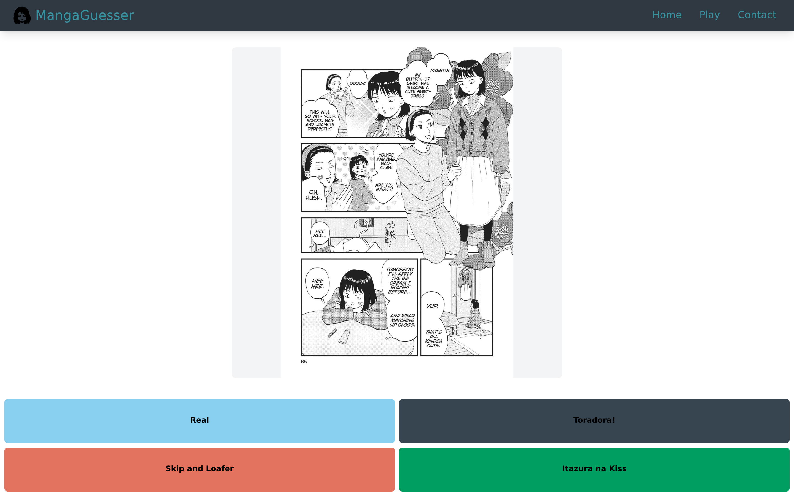
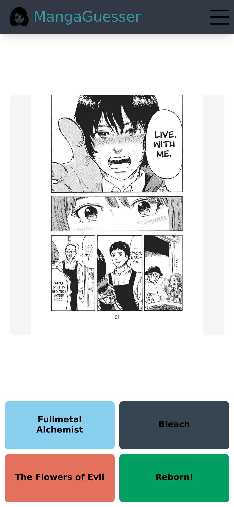

# mangaguesser-next

Mangaguesser is a game that shows you a manga panel, you gotta pick from 4 different series and try to guess which one is correct.

I came up with this idea one day after playing a lot of *dle games. The main issue
was finding images to use. I ended up having to scrape the images and serve them from my backend. 
Cloudflare makes it really easy to cache them with their CDN, so they are really quick to serve anywhere.

I also really wanted to use Next.js so I decided for it instead of just traditional React + Vite.

**Live at:** [mangaguesser.alejoseed.com](https://mangaguesser.alejoseed.com)

<p align="center">
  
  
</p>

This repo is the frontend only (with some Next.js goodies for handling cookies). 
The API is a separate service
[https://github.com/alejoseed/Mangaguesser-Gobackend](https://github.com/alejoseed/Mangaguesser-Gobackend), currently serving from
`node1.alejoseed.com`.

## Stack

- Next.js 16 with the App Router, React 19, TypeScript
- Tailwind CSS 4 via PostCSS
- Geist, self-hosted through `next/font` from `app/fonts/`
- `next/image`, with `next.config.ts` allowlisting `node1.alejoseed.com/mangas/**`

## Running it locally

```sh
npm install
npm run dev      # http://localhost:3000
```

| Command         | What it does                       |
| :-------------- | :--------------------------------- |
| `npm run dev`   | Dev server                         |
| `npm run build` | Production build                   |
| `npm run start` | Serve the production build         |
| `npm run lint`  | ESLint                             |

`API_BASE` falls back to `https://node1.alejoseed.com`, so the game works
against production without any env setup. To point it at a local backend:

```sh
NEXT_PUBLIC_API_URL=http://localhost:8080 npm run dev
```

## How a round works

Two endpoints, both in [`app/play/actions.ts`](app/play/actions.ts):

|         Request          |                        Returns                           |
| :----------------------- | :------------------------------------------------------- |
| `GET /random_manga`      | `{ mangas[], imageUrl }` plus a session token            |
| `GET /answer?number=<n>` | `{ correct: boolean }`, authorized with `Bearer <token>` |

The session token arrives either in the response body or in a
`mangaguesser_token` cookie, and gets mirrored into `localStorage` under
`mangaSession` so a refresh doesn't start a new session. The session is also stored in my database.
[`useMangaGame.ts`](app/play/useMangaGame.ts) owns that state along with the
current panel and loading flag. A correct guess renders
[`CorrectPopUp.tsx`](app/play/CorrectPopUp.tsx).

Guesses are checked server side: the client posts an index and the backend
answers `correct` or not, so the scoring logic isn't in the browser.


## Layout

```text
app/
├── page.tsx          # landing page
├── layout.tsx        # root layout, metadata, fonts
├── navbar.tsx
├── hamNav.tsx        # mobile nav
├── not-found.tsx
├── globals.css
├── contact/page.tsx
├── login/page.tsx
├── play/
│   ├── page.tsx          # the game screen
│   ├── useMangaGame.ts   # session + round state
│   ├── actions.ts        # API calls
│   ├── mangaButtons.tsx  # answer buttons
│   └── CorrectPopUp.tsx
├── types/index.d.ts  # MangasResponse
└── fonts/            # Geist woff files
```

## Deploying

I am using Vercel for the frontend. The backend is deployed on a VPS so deploying is as easy 
as having Nginx or simply just exposing the app through the port you want.
